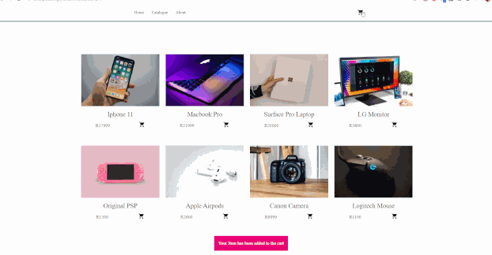

# JavaScript Online store

**In this project I was tasked to create an online store/shopping cart using JavaScript and LocalStorage.**

In this project a cart system with products was created purely in JavaScript without the use of a Database. LocalStorage was used
and the products were stored in a JSON format.

## Demo

https://ethanpikedev.github.io/JavaScriptStore/ - View Live Pages version

## How to use the project
Simply clone the repository and open the index.html File to run this project

## Credits
Project Made by Ethan Pike for HyperionDev Bootcamp Capstone
